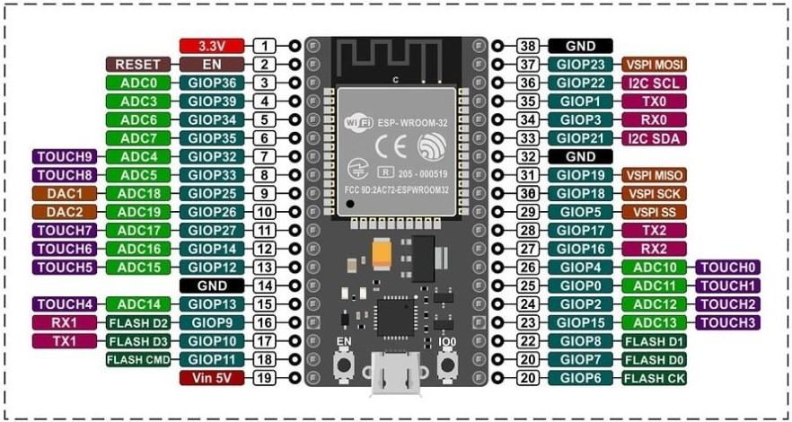
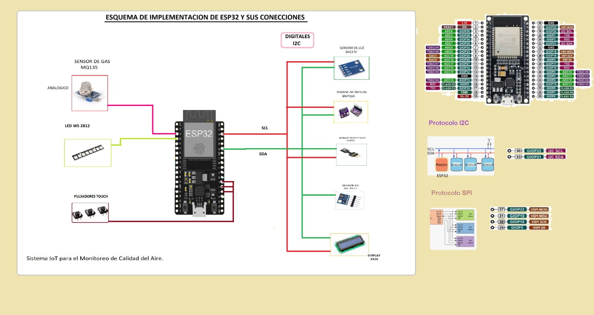

# Proyecto ABP \#23: Sistema de alerta de calidad del aire

## Descripción General

Este proyecto tiene como objetivo desarrollar un sistema IoT para monitorear la calidad del aire (AQI) en tiempo real en zonas urbanas, proporcionando alertas publicas y datos accesibles a los ciudadanos y autoridades.  
El sistema esta diseñado en torno a un microcontrolador **ESP32**, utiliza varios sensores para medir la concentración de gases, la intensidad de luz, la radiación UV, la temperatura, la presion atmosferica y la humedad. Además, cuenta con una interfaz de usuario a través de un **visualizador LCD** de 2x16 caracteres, un sistema de navegación mediante touchpads capacitivos, y una tira LED **WS2812** que cambia de color en función del AQI.    

### Componentes:

1. **Sensores:**
   - **MQ135**: Medición de la concentración de gases (CO2, NOx, etc.).
   - **AHT25**: Medición de temperatura y humedad.
   - **BMP280**: Medición de temperatura y presión barométrica.
   - **BH1750**: Sensor de intensidad de luz en lux.
   - **ML8511**: Sensor de radiación ultravioleta (UV).

2. **Visualizadores**
   - **Display LCD de 2x16**: Visualización de los valores de los sensores y el AQI.    

3. **Perifericos de entrada**
   - **Touchpads capacitivos**: Para navegar por el menú del LCD.    

4. **Actuadores**
   - **Tira LED WS2812**: Indicador visual del AQI usando diferentes colores.  

## Estructura del Proyecto

lib/       
  AHT25/   
    ├── AHT25Sensor.cpp   
    ├── AHT25Sensor.h    
  BH1750/   
    ├── BH1750Sensor.cpp   
    ├── BH1750Sensor.h      
  BMP280/   
    ├── BMP280Sensor.cpp   
    ├── BMP280Sensor.h      
  LCDDisplay/   
    ├── LCDDisplay.cpp   
    ├── LCDDisplay.h      
  ML8511/   
    ├── ML8511Sensor.cpp   
    ├── ML8511Sensor.h      
  MQ135/   
    ├── MQ135Sensor.cpp   
    ├── MQ135Sensor.h     
  Touch/   
    ├── TouchController.cpp   
    ├── TouchController.h    
  WS2812/   
    ├── WS2812Controller.cpp   
    ├── WS2812Controller.h         
  LCDparalelo/   
    ├── LCDParallelDisplay.cpp   
    ├── LCDParallelDisplay.h   

src/  
├── main.cpp

  

## Estructura del Código

### 1. **Archivo `main.cpp`:**

Este es el archivo principal que inicializa los sensores, el LCD, los touchpads y la tira LED. El bucle principal realiza lecturas de los sensores, actualiza el menú del LCD, y controla la tira LED en función del AQI calculado.

#### **Configuración de Pines:**   
A continuacion se muestra un diagrama con la distribucion de pines en el modulo ESP32-Wroom de **Nodemcu**
  

    

**Asignacion**   

- **MQ135** (sensor analógico): Pin ADC0 (GIOP36, pata 3)   
- **ML8511** (sensor analogico): Pin ADC5 (GIOP33, pata 8)
- **touchpads capacitivos**: Pin TOUCH0, TOUCH1 y TOUCH2 (GIOP4/pata 26, GIOP0/pata 25 y GIOP2/pata 24)  
- **tira LED WS2812**: Pin GIOP39 / pata 4
- **Dispositivos I2C**: Pin I2C SDA / pata 33 y Pin I2C SCL / 36  
  

  
  
#### **Inicialización de Sensores y Periféricos:**
- En el `setup()`, se inicializan todos los sensores y periféricos (LCD, touchpads, LED).   
La primera pantalla del menú se muestra en el LCD.
  
#### **Lógica del Menú:**
- La función `navegarMenu()` controla la navegación por el menú del LCD mediante los touchpads capacitivos. El **touchpad TOUCH0** avanza al siguiente menú, y el **touchpad TOUCH1** retrocede al menú anterior.

#### **Bucle Principal (`loop()`):**
- El bucle principal realiza las siguientes tareas:
  1. **Navegación en el Menú:** Comprueba si se ha tocado algún touchpad y actualiza el menú en consecuencia.
  2. **Lectura de Sensores:** Lee los valores de los sensores (MQ135, AHT25, BMP280, BH1750, y ML8511).
  3. **Actualización del LCD:** Muestra los valores en el LCD, dependiendo de la pantalla seleccionada en el menú.
  4. **Control de la Tira LED WS2812:** Calcula el AQI y actualiza la tira LED con un color que representa la calidad del aire **QUE ES EL AQI?**.

### 2. **Clase `BH1750Sensor` (Sensor de Luz):**

#### **Descripción:**
Esta clase maneja el sensor de intensidad de luz **BH1750**, que mide la luminosidad en lux. 

#### **Métodos:**
- **begin():** Inicializa el sensor BH1750 en el bus I2C.
- **leerLux():** Lee y devuelve la intensidad de luz en lux.

#### **Uso:**
El sensor BH1750 se inicializa en el `setup()` y se llama a `leerLux()` en el bucle principal para obtener la intensidad de luz y mostrarla en el menú correspondiente del LCD.

### 3. **Clase `ML8511Sensor` (Sensor de Radiación UV):**

#### **Descripción:**
Esta clase gestiona el sensor de radiación ultravioleta **ML8511**, que mide la intensidad de los rayos UV.

#### **Métodos:**
- **begin():** No requiere inicialización especial, pero se incluye para mantener la consistencia en la estructura.
- **leerUV():** Lee el valor analógico del sensor y lo convierte en un índice UV aproximado.

#### **Uso:**
El sensor ML8511 se inicializa en el `setup()` y `leerUV()` se llama en el bucle principal. El índice UV se muestra en el LCD en la sección correspondiente del menú.
  
### 4. **CLase `MQ135Sensor` (Sensor de gases)**  

#### **Descripción:**
Esta clase es la encargada de gestionar el sensor **MQ135** que mide la calidad del aire. El sensor MQ135 puede detectar concentraciones de gas entre 10 y 1000 ppm y es útil para la detección de gases nocivos como amoniaco, dióxido de nitrógeno, alcohol, benceno, dióxido y monóxido de carbono.   

#### **Métodos:**
- **begin():** Inicializa el sensor y configura el filtro de media móvil para suavizar las lecturas.
- **readFilteredData():** Lee los datos del sensor, aplica un filtro de media móvil para suavizar las lecturas y descarta valores fuera de un rango predefinido (10-1000 PPM).   
Devuelve el valor filtrado o -1 si la lectura es inválida.   
**QUE ES LA MEDIA MOVIL?**    

### 5. **Clase `LCDDisplay` (Pantalla LCD de 2x16):**

#### **Descripción:**
Esta clase maneja la pantalla LCD I2C de 2x16 caracteres. Proporciona la capacidad de mostrar diferentes menús con los valores de los sensores.

#### **Métodos:**
- **begin():** Inicializa la pantalla LCD y enciende la retroiluminación.
- **displayMenu(int menu):** Muestra el nombre del menú actual en la primera línea del LCD.
- **updateMenu(int menu, ...):** Actualiza el contenido de la segunda línea del LCD con los valores de los sensores correspondientes al menú seleccionado.

#### **Menús Disponibles:**
1. **AQI:** Muestra el AQI calculado a partir de los datos del MQ135.
2. **Temperatura/Humedad:** Muestra la temperatura y la humedad medida por el AHT25.
3. **Luz/UV:** Muestra la intensidad de luz del BH1750 y el índice UV del ML8511.  
  

### 6. **Clase `TouchController` (Controlador de Touchpads):**

#### **Descripción:**
Esta clase gestiona las tres superficies metálicas conectadas a las entradas capacitivas TOUCH0, TOUCH1 y TOUCH2 del ESP32, que permiten la navegación por el menú del LCD.

#### **Métodos:**
- **begin():** Inicializa las entradas capacitivas (no requiere configuración adicional).
- **checkTouch():** Comprueba si alguna de las superficies táctiles ha sido activada y devuelve un código para avanzar o retroceder en el menú.

#### **Navegación:**
- **TOUCH0 (Next):** Avanza al siguiente menú.
- **TOUCH1 (Previous):** Retrocede al menú anterior.

### 7. **Clase `WS2812Controller` (Tira LED WS2812):**

#### **Descripción:**
Esta clase controla la tira LED **WS2812**, la cual cambia de color según el AQI obtenido de los sensores.

#### **Métodos:**
- **begin():** Inicializa la tira LED.
- **updateLED(int aqi):** Cambia el color de la tira LED según el valor del AQI. El color se actualiza de la siguiente manera:
  - **Verde:** AQI ≤ 50 (Buena calidad del aire).
  - **Amarillo:** AQI entre 51 y 100 (Moderada calidad del aire).
  - **Rojo:** AQI > 100 (Pobre calidad del aire).

### 8. **Clase `AHT25Sensor` Sensor de Temperatura y Humedad**

Estos archivos implementan la clase `AHT25Sensor`, responsable de gestionar el sensor **AHT25** que mide temperatura y humedad relativa.

#### **Metodos:**
- **`begin()`:** Inicializa el sensor **AHT25** y verifica su disponibilidad en el bus I2C.  

- **`readData(float &temperature, float &humidity)`:**  Lee los datos de temperatura y humedad desde el sensor.   
Aplicando un filtro que descarta valores fuera de los rangos aceptables.   
Devuelve `true` si los datos son válidos y `false` si no lo son.  
  
### 9. **Clase `BMP280Sensor` Sensor de presion barometrica y temperatura**

Estos archivos implementan la clase `BMP280Sensor`, que gestiona el sensor **BMP280** para la medición de temperatura,  y presión barométrica.

#### **Metodos:**
- **`begin()`:** Inicializa el sensor **BMP280** y verifica su disponibilidad en el bus I2C.  

- **`readData(float &temperature, float &pressure)`:** Lee los datos de temperatura, y presión del sensor.   
Aplica filtros para descartar valores fuera de rangos predefinidos.   
Devuelve `true` si los datos son válidos y `false` si no lo son.  
  
### 10. **Clase `LCDParallelDisplay` para Pantalla LCD 2x16 con Conexión Paralela de 4 Bits**

## Introducción

La clase `LCDParallelDisplay` se propone para manejar un **LCD de 2x16 caracteres** conectado en **modo paralelo de 4 bits**.  
Esta clase coexistirá con la clase `LCDDisplay` que maneja la pantalla en modo **I2C**.   
Ambas clases compartirán la misma funcionalidad de menús navegables y visualización de datos de sensores.

## Conexiones Paralelas de 4 Bits

Para conectar el LCD en modo paralelo de 4 bits, se utilizarán los siguientes pines:

- **RS (Register Select)**: Selecciona el registro de datos o comandos.
- **RW (Read/Write)**: Indica si se está leyendo o escribiendo datos.
- **D4-D7**: Pines de datos para enviar información de 4 bits.
  
La configuración de 4 bits es una manera eficiente de comunicar datos con el LCD utilizando menos pines de datos, lo cual es ideal cuando se quieren preservar pines GPIO para otros periféricos.

## Funcionalidad Esperada

El objetivo es replicar la funcionalidad de la clase `LCDDisplay` para I2C, de forma que la nueva clase `LCDParallelDisplay` tenga un menú navegable utilizando los touchpads capacitivos y muestre la misma información de los sensores (AQI, temperatura, humedad, luz, radiación UV).
  
# ***CONFIGURACIONES***
    
## **Librerias necesarias**

Para que el programa funcione es necesario instalar las siguientes librerias en el IDE:  

- **Adafruit BMP280.h**
- **Adafruit AHTX0.h**
- **MQ135.h**  
- **BH1750.h**  
- **LiquidCrystal_I2C.h**   
- **LiquidCrystal.h** 
- **Adafruit_NeoPixel**   

Para el caso de PlatformIO la mismas pueden instalarse desde el gestor de librerias buscando el nombre de cada una, y haciendo click en `install`.  

### 2. **Configuración de Hardware**

Los sensores se conectan al ESP32-Wroom según las siguientes especificaciones:

- **MQ135 (Analógico):**
  - **VCC:** 3.3V
  - **GND:** GND
  - **Salida de señal:** GPIO36 (ADC1_CH0)  
    
- **ML8511(Analógico):**
  - **VCC:** 3.3V
  - **GND:** GND
  - **Salida de señal:** GPIO33 (ADC5_CH0)
  
- **AHT25 (I2C):**
  - **VCC:** 3.3V
  - **GND:** GND
  - **SDA:** GPIO21
  - **SCL:** GPIO22
  
- **BMP280 (I2C):**
  - **VCC:** 3.3V
  - **GND:** GND
  - **SDA:** GPIO21
  - **SCL:** GPIO22  
  
- **BH1750 (I2C):**
  - **VCC:** 3.3V
  - **GND:** GND
  - **SDA:** GPIO21
  - **SCL:** GPIO22
  
- **Display LCD (I2C):**
  - **VCC:** 3.3V
  - **GND:** GND
  - **SDA:** GPIO21
  - **SCL:** GPIO22
  
- **Tira led WS2812:**
  - **VCC:** 3.3V
  - **GND:** GND
  - **CONTROL:** GIOP39
  
 

# Funcionamiento del Menú

### Menú Navegable
El sistema tiene tres menús principales que el usuario puede recorrer utilizando las superficies táctiles capacitivas:
1. **Menú 1: AQI**
   - Muestra el índice de calidad del aire (AQI).
   
2. **Menú 2: Temperatura/Humedad**
   - Muestra la **temperatura** y la **humedad** medidas por el sensor **AHT25**.

3. **Menú 3: Luz/UV**
   - Muestra la **intensidad de luz** del sensor **BH1750** y el índice **UV** calculado por el sensor **ML8511**.

El usuario puede navegar entre estos menús tocando las superficies conectadas a **TOUCH0** (siguiente menú) y **TOUCH1** (menú anterior).

## Implementación del AQI con Tira LED

La tira **WS2812** se utiliza para mostrar el estado de la calidad del aire de manera visual e intuitiva. Según el valor de **AQI**, la tira cambia de color.  

## **QUE ES EL AQI?**:  
El Índice de Calidad del Aire (AQI) es una medida desarrollada por la *Agencia de Protección Ambiental* de los Estados Unidos (EPA) para reportar la calidad del aire y sus posibles efectos sobre la salud. El AQI utiliza una escala de 0 a 500, donde los valores más altos representan un mayor nivel de contaminación y mayor riesgo para la salud. El índice se calcula para cinco contaminantes principales:

- Ozono a nivel del suelo (O₃)
- Partículas en suspensión PM2.5 (material particulado fino)
- Partículas en suspensión PM10
- Monóxido de carbono (CO)
- Dióxido de azufre (SO₂)  
Cada uno de estos contaminantes tiene umbrales específicos que corresponden a distintos valores del AQI, los cuales se dividen en categorías que indican el nivel de preocupación para la salud:

- 0 a 50 (Verde): Calidad del aire buena.
- 51 a 100 (Amarillo): Calidad del aire moderada.
- 101 a 150 (Naranja): No saludable para grupos sensibles.
- 151 a 200 (Rojo): No saludable para todos.
- 201 a 300 (Púrpura): Muy no saludable.
- 301 y más (Marrón): Peligroso.  

## **Adaptación del AQI al proyecto ABP#24**
Dado que nuestro proyecto cuenta con los siguientes sensores: MQ135 (gases), BMP280 (presión), BH1750 (intensidad de luz) y ML8511 (radiación UV), podemos adaptar el cálculo del AQI principalmente utilizando el MQ135 para medir la concentración de gases como CO₂, NOx, y otros contaminantes que afectan la calidad del aire. También podríamos estimar efectos indirectos de otros contaminantes con este sensor.

Fórmulas para el Cálculo del AQI
El cálculo del AQI para cada contaminante se realiza mediante la siguiente fórmula general:  
  
  

  

Donde:

- I_high y I_low son los valores de AQI correspondientes a las concentraciones de contaminantes C_high y C_low.
- C es la concentración medida del contaminante.  

Con el MQ135, podríamos utilizar la concentración de CO₂ y otros gases para derivar una estimación del AQI. Por ejemplo, la concentración de CO₂ en ppm (partes por millón) se puede convertir en un valor aproximado de AQI según las categorías de la EPA. 

Este comportamiento se actualiza en cada ciclo del bucle principal.

## Que es un filtro de media movil?
Un filtro de media móvil es un método numérico utilizado para reducir el ruido y la volatilidad en una serie de datos, permitiendo visualizar tendencias y patrones más claros. Su función básica es calcular la media de los valores más recientes de la serie y utilizarla como una aproximación más estable de la tendencia actual.

En términos prácticos, un filtro de media móvil se aplica de la siguiente manera:

1. Se define un tamaño de ventana (N) que indica cuántos valores más recientes se consideran para calcular la media.
2. Se itera sobre la serie de datos, empezando desde el primer valor y hasta el valor actual.
3. Se calcula la media de los N valores más recientes, descartando el primer valor de la ventana al calcular la media y añadiendo el nuevo valor.
3. El resultado es el valor filtrado, que se utiliza como una estimación más estable de la tendencia actual.   

**Ventajas y desventajas**  
* Ventajas:   
  - sencillo de implementar  
  - Rápido de calcular   
  - Eficaz para reducir el ruido de alta frecuencia.  

* Desventajas:   
  - Puede eliminar componentes auténticos de la señal si el tamaño de la ventana es demasiado grande.   
  - Puede ser débil para detectar cambios bruscos en la tendencia.

### 3. **Compilación y Carga del Código**

Seguir los siguientes pasos:  

1. Abrir el proyecto en el IDE Platformio o en VScode con Platformio integrado.
2. Seleccionar la placa **nodemcu-32s** en el menú **Tools > Board**.
3. Seleccionar el puerto correcto donde está conectado el ESP32.
4. Compilar y cargar el código en el ESP32.

### 4. **Monitoreo de Datos**

Abrir el **Monitor Serie** en el IDE y configurarlo a **115200 baudios** para observar las lecturas de los sensores. Los datos se mostrarán en tiempo real y se indicará si alguna lectura es inválida debido a valores fuera de los rangos definidos.

## Futuras Expansiones

Este proyecto está diseñado para ser fácilmente escalable.   
Se puedes agregar más sensores o funcionalidades, como enviar los datos a una plataforma en la nube o a un servidor remoto.   
El código modular facilita la incorporación de nuevas características sin afectar la estructura existente.

## Licencia

Este proyecto está licenciado bajo la Licencia Creative Commons Atribución-NoComercial (CC BY-NC). Esta licencia permite que otros remixen, adapten y construyan sobre el trabajo de forma no comercial y, aunque sus nuevos trabajos deben también reconocer al autor original y ser no comerciales, no tienen que licenciar sus obras derivadas en los mismos términos.

Esta licencia es adecuada para un uso educativo y de aprendizaje, permitiendo la libre distribución y utilización del material mientras se protege contra el uso comercial sin autorización previa. Para usos comerciales, es necesario contactar a los autores para obtener permiso.

Para obtener más información sobre esta licencia y ver una copia completa de sus términos, visite [Creative Commons Atribución-NoComercial (CC BY-NC)](https://creativecommons.org/licenses/by-nc/4.0/).