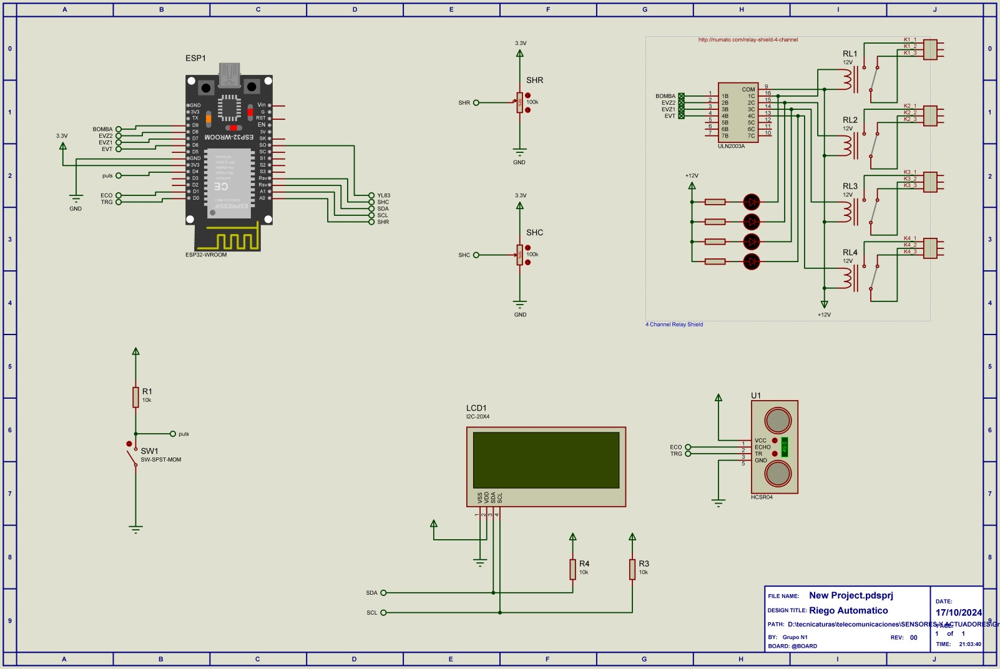

# Proyecto ABP: Sistema de riego automatico

## Descripción General

Este proyecto tiene como objetivo desarrollar un sistema de riego automatico que permita tomar informacion de varios sensores y actuar sobre una bomba y una electrovalvula.  
El sistema esta diseñado en torno a un microcontrolador **ESP32**, utiliza varios sensores para medir la humedad del suelo, detectar lluvia, medir el nivel de un tanque de agua. Además, cuenta con una interfaz de usuario a través de un **visualizador LCD** de 2x20 caracteres, que muestra el estado del sistema de forma ciclica.    

### Componentes:

1. **Sensores:**
   - **YL-69**: Sensor de humedad del suelo (resistivo).
   - **V1.2**: Sensor de humedad del suelo (capacitivo).
   - **YL-83**: Sensor de Lluvia.
   - **HC-SR04**: Sensor de ultrasonido, para medir el nivel del tanque de reserva.
   
   - **Display LCD de 2x20 I2C**: Visualización de los valores de los sensores y los actuadores.    

3. **Perifericos de entrada**
   - **Touchpads capacitivos**: Para navegar por el menú del LCD.    

4. **Actuadores**
   - **Salida a rele optoacoplada para bomba**: Acciona el encendido de una bomba aislando al controlador de los circuitos de potencia.   
   - **Salida a rele optoacoplada para electrovalvula**: Accionamiento de una electrovalvula mediante rele, lo que permite manejar distintos tipos de valvulas y tensiones sin que el controlador tenga contacto diresto con la etapa de potencia.

## Estructura del Proyecto

lib/       
  YL-69/   
    ├── sensorYL-69.cpp   
    ├── sensorYL-69.h    
  YL-83/   
    ├── sensorYL-83.cpp   
    ├── sensorYL-83.h      
  Hum_Cap/   
    ├── sensor_hum_cap.cpp   
    ├── sensor_hum_cap.h      
  HC-SR04/   
    ├── sensorHC-SR04.cpp   
    ├── sensorHC-SR04.h      
  LCDDisplay/   
    ├── LCDDisplay.cpp   
    ├── LCDDisplay.h        
  Relay/   
    ├── Salida_relay.cpp   
    ├── Salida_relay.h     
  Touch/   
    ├── TouchController.cpp   
    ├── TouchController.h    

src/  
├── main.cpp

  

## Estructura del Código

### 1. **Archivo `main.cpp`:**

Este es el archivo principal que inicializa los sensores, el LCD, los touchpads y los actuadores. El bucle principal realiza lecturas de los sensores, actualiza el menú del LCD, y controla los actuadores en función de la humedad, la deteccion de lluvia y el nivel de agua de reserva de acuerdo a la siguiente logica:  
    
El controlador toma lectura de todos los sensores, dos de humedad de suelo que permite el manejo de dos zonas independientes, uno de lluvia, y uno de ultrasonido para medir el nivel de reserva de agua.   
Ademas, se cuenta con una salida para bomba y tres accionamientos de electrovalvulas, una para el ingreso de agua al tanque, y una para cada zona de riego.  
* **Si la humedad en una zona cae por debajo de un umbral establecido**, se enciende la bomba y se activa la electrovalvula que corresponde a esa zona de riego.
* **Si se detecta un nivel de reserva de agua inferior al minimo establecido**, se activa la electrovalvula correspondiente al ingreso de agua al tanque desde la red.  
* **Si se detecta lluvia**, se interrumpe cualquier ciclo de riego hasta que deje de llover.   

#### **Configuración de Pines:**   
A continuacion se muestra un diagrama con la distribucion de pines en el modulo ESP32-Wroom de **Nodemcu**
  

    

**Asignación para implemetar sobre modelo Nodemcu-32S de 38 pines**   

- **YL-69** (sensor analógico): Pin ADC0 (GIOP36 / pata 3)   
- **Hum_Cap** (sensor analogico): Pin ADC5 (GIOP33 / pata 8)  
- **YL-83** (entrada digital): Pin GIOP12 / pata 13  
- **HC-SR04** (1 entrada digital, 1 salida digital): Pin GIOP39 / pata 4 (Trigg); Pin GIOP34 / pata 5 (Echo)
- **pulsador**: Pin TOUCH0(GIOP4 / pata 26)   
- **Salidas relay**: Pin GIOP25 / pata 9; Pin GIOP26 / pata 10; Pin GIOP27 / pata 11; Pin GIOP14 / pata 12
- **Dispositivos I2C**: Pin I2C SDA / pata 33 y Pin I2C SCL / pata 36  
  
**Asignación para implemetar sobre modelo ESP32-S2-MIN-1 (PROTEUS)**   

- **YL-69** (sensor analógico): Pin A0   
- **Hum_Cap** (sensor analogico): Pin A3 
- **YL-83** (entrada digital): Pin 12 
- **HC-SR04** (1 entrada digital, 1 salida digital): Pin 0 (Trigg); Pin 1 (Echo)
- **pulsador**: Pin 4   
- **Salidas relay**: Pin 6; Pin 7; Pin 8; Pin 9
- **Dispositivos I2C**: Pin I2C SDA / pata A4 y Pin I2C SCL / pata A5  
  

  
  
#### **Inicialización de Sensores y Periféricos:**
- En el `setup()`, se inicializan todos los sensores y periféricos (LCD, touchpads, RELAY).   
La primera pantalla del menú se muestra en el LCD.
  
#### **Lógica del Menú:**
- La función `navegarMenu()` controla la navegación por el menú del LCD mediante el touchpad capacitivo. El **touchpad TOUCH0** avanza al siguiente menú, cada vez que es pulsado.

#### **Bucle Principal (`loop()`):**
- El bucle principal realiza las siguientes tareas:
  1. **Navegación en el Menú:** Comprueba si se ha tocado el touchpad y actualiza el menú en consecuencia.
  2. **Lectura de Sensores:** Lee los valores de los sensores y actualiza el estado del sistema.
  3. **Actualización del LCD:** Muestra los valores en el LCD, dependiendo de la pantalla seleccionada en el menú.
  4. **Control de los actuadores:** Ejecuta la logica descripta arriba actuando sobre los rele en funcion del estado del sistema.

### 2. **Clase `sensorYL-69` (Sensor de humedad de suelo resistivo):**

#### **Descripción:**
Esta clase maneja el sensor de humedad de suelo **YL-69**, que mide la humedad del suelo mediante un fenomeno resistivo. 

#### **Métodos:**
- **begin():** Inicializa el sensor YL-69.
- **leerHumedad_Res():** Lee y devuelve un valor de humedad en porcentaje.

#### **Uso:**
El sensor YL-69 se inicializa en el `setup()` y se llama a `leerHumedad_Res()` en el bucle principal para obtener la humedad del suelo y mostrarla en el menú correspondiente del LCD.

### 3. **Clase `sensorYL-83` (Sensor de Lluvia):**

#### **Descripción:**
Esta clase gestiona el sensor de deteccion de lluvia **YL-83**, que basicamente detecta si esta lloviendo.

#### **Métodos:**
- **begin():** No requiere inicialización especial, pero se incluye para mantener la consistencia en la estructura.
- **detectarLluvia():** Lee la entrada digital correspondiente al sensor, y devuelve un valor bool.

#### **Uso:**
El sensor ML8511 se inicializa en el `setup()` y `detectarLluvia()` se llama en el bucle principal. Se muestra en el LCD en la sección correspondiente del menú.
  
### 4. **CLase `sensor_hum_cap` (Sensor de humedad de suelo capacitivo)**  

#### **Descripción:**
Esta clase maneja el sensor de humedad de suelo capacitivo **V 1.2**, que mide la humedad del suelo mediante un fenomeno capacitivo.   

#### **Métodos:**
- **begin():** Inicializa el sensor.
- **leerHumedad_Cap():** Lee y devuelve un valor de humedad en porcentaje.    

#### **Uso:**
El sensor se inicializa en el `setup()` y se llama a `leerHumedad_Cap()` en el bucle principal para obtener la humedad del suelo y mostrarla en el menú correspondiente del LCD.  
  
### 5. **Clase `sensorHC-SR04` (Sensor ultrasonico por eco):**

#### **Descripción:**
Esta clase maneja el sensor de humedad de suelo **HC-SR04**, que mide el nivel de reserva de agua en un tanque por medio de eco. 

#### **Métodos:**
- **begin():** Inicializa el sensor HC-SR04.
- **leerNivel():** Lee y devuelve un nivel de reserva de agua porcentaje.  
  
#### **Uso:**
El sensor HC-SR04 se inicializa en el `setup()` y se llama a `leerNivel()` en el bucle principal para obtener la humedad del suelo y mostrarla en el menú correspondiente del LCD.

### 6. **Clase `LCDDisplay` (Pantalla LCD de 2x16):**

#### **Descripción:**
Esta clase maneja la pantalla LCD I2C de 2x20 caracteres. Proporciona la capacidad de mostrar diferentes menús con los valores de los sensores y el estado de los actuadores.

#### **Métodos:**
- **begin():** Inicializa la pantalla LCD y enciende la retroiluminación.
- **displayMenu(int menu):** Muestra el nombre del menú actual en la primera línea del LCD.
- **updateMenu(int menu, ...):** Actualiza el contenido de la segunda línea del LCD con los valores de los sensores correspondientes al menú seleccionado.

#### **Menús Disponibles:**
1. **Menú 1: Humedad en el suelo** 
2. **Menú 2: Riego**
3. **Menú 3: Reserva de agua**  
  

### 7. **Clase `Salida_relay` (Controlador de reles):**

#### **Descripción:**
Esta clase gestiona las cuatro salidas optoacoppladas para el el manejo de la bomba y las tres electrovalvulas.

#### **Métodos:**
- **begin():** Inicializa las salidas.
- **actualizar_salidas():** se ejecuta esta funcion para cambiar el estado de las cuatro salidas que posee el controlador, basado en el valor de una variable global en de tipo Array que contiene cuatro valor booleanos correspondientes a: 
Salidas[0]->BOMBA  
Salidas[1]->EV_zona_1  
Salidas[2]->EV_zona_2  
Salidas[3]->EV_ent_tanque 

#### **Uso:**
Las salidas se inicializan en el `setup()`, luego en el bucle principal se actualiza los valores del Array `Salidas` y se llama a `actualizar_salidas()` para cambiar el estado de las mismas. Ademas este mismo Array se consulta para mostrar en el menú correspondiente del LCD el estado de cada salida.

### 8. **Clase `TouchController` (Controlador de Touchpads):**

#### **Descripción:**
Esta clase gestiona las tres superficies metálicas conectadas a las entradas capacitivas TOUCH0, TOUCH1 y TOUCH2 del ESP32, que permiten la navegación por el menú del LCD.

#### **Métodos:**
- **begin():** Inicializa las entradas capacitivas (no requiere configuración adicional).
- **checkTouch():** Comprueba si alguna de las superficies táctiles ha sido activada y devuelve un código para avanzar o retroceder en el menú.

#### **Navegación:**
- **TOUCH0 (Next):** Avanza al siguiente menú.  

  
# ***CONFIGURACIONES***
    
## **Librerias necesarias**

Para que el programa funcione es necesario instalar las siguientes librerias en el IDE:  

- **AQUI VAMOS A PONER TODAS LAS LIBRERIAS NECESARIAS**
- **LiquidCrystal_I2C.h**   

Para el caso de PlatformIO la mismas pueden instalarse desde el gestor de librerias buscando el nombre de cada una, y haciendo click en `install`.  

### 2. **Configuración de Hardware**

Los sensores se conectan al ESP32-Wroom según las siguientes especificaciones:

- **YL-69(Analógico):**
  - **VCC:** 3.3V
  - **GND:** GND
  - **Salida de señal:** GPIO36 (ADC0_CH0)  
    
- **Hum_Cap(Analógico):**
  - **VCC:** 3.3V
  - **GND:** GND
  - **Salida de señal:** GPIO39 (ADC3_CH0)  

- **YL-83(digital):**
  - **VCC:** 3.3V
  - **GND:** GND
  - **Salida de señal:** GPIO12    

- **HC-SR04(digital):**
  - **VCC:** 3.3V
  - **GND:** GND
  - **Entrada de señal Trigger:** GPIO39
  - **Salida de señal Echo:** GPIO34     
  
- **Display LCD (I2C):**
  - **VCC:** 3.3V
  - **GND:** GND
  - **SDA:** GPIO21
  - **SCL:** GPIO22
  
# Funcionamiento del Menú

### Menú Navegable
El sistema tiene un menu navegable que muestra que consta de tres pantallas:  

1. **Menú 1: Humedad en el suelo**
   - Muestra la humedad medida en las dos zonas Z1 y Z2.
   - Si llueve se muestra el mensaje: Lluvia, lectura interrumpida.
   
2. **Menú 2: Riego**
   - Muestra el estado de la Bomba de riego y las Electrovalvulas de cada zona EVZ1 y EVZ2.  
   - Si llueve se muestra el mensaje: Lluvia, riego interrumpido.

3. **Menú 3: Reserva de agua**
   - Muestra el nivel de reserva de agua en porcentaje y el estado de la electrovalvula EV_ent_tanque.

El usuario puede navegar entre estos menús tocando la superficie conectada a **TOUCH0** (siguiente menú).

### 3. **Compilación y Carga del Código**

Seguir los siguientes pasos:  

1. Abrir el proyecto en el IDE Platformio o en VScode con Platformio integrado.
2. Seleccionar la placa **nodemcu-32s** en el menú **Tools > Board**.
3. Seleccionar el puerto correcto donde está conectado el ESP32.
4. Compilar y cargar el código en el ESP32.

### 4. **Monitoreo de Datos**

Abrir el **Monitor Serie** en el IDE y configurarlo a **115200 baudios** para observar las lecturas de los sensores. Los datos se mostrarán en tiempo real y se indicará si alguna lectura es inválida debido a valores fuera de los rangos definidos.

## Futuras Expansiones

Este proyecto está diseñado para ser fácilmente escalable.   
Se puede agregar más sensores o funcionalidades, como enviar los datos a una plataforma en la nube o a un servidor remoto.   
El código modular facilita la incorporación de nuevas características sin afectar la estructura existente.

## Licencia

Este proyecto está licenciado bajo la Licencia Creative Commons Atribución-NoComercial (CC BY-NC). Esta licencia permite que otros remixen, adapten y construyan sobre el trabajo de forma no comercial y, aunque sus nuevos trabajos deben también reconocer al autor original y ser no comerciales, no tienen que licenciar sus obras derivadas en los mismos términos.

Esta licencia es adecuada para un uso educativo y de aprendizaje, permitiendo la libre distribución y utilización del material mientras se protege contra el uso comercial sin autorización previa. Para usos comerciales, es necesario contactar a los autores para obtener permiso.

Para obtener más información sobre esta licencia y ver una copia completa de sus términos, visite [Creative Commons Atribución-NoComercial (CC BY-NC)](https://creativecommons.org/licenses/by-nc/4.0/).