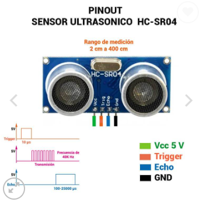

# Sensor Ultrasónico HC-Sr04. 

El **sensor HC-SR04** mide distancias mediante el envío de un pulso ultrasónico que se refleja en un objeto (como el agua en un tanque) y se devuelve al sensor. El programa mide el tiempo que tarda el pulso en regresar y lo convierte en una distancia.



## 1. Archivo de cabecera `sensor_hcsr04.h`

Este archivo contiene la definición de la clase que utilizamos para interactuar con el sensor HC-SR04.

Veamos cada parte:
```cpp
#ifndef SENSOR_HCSR04_H
#define SENSOR_HCSR04_H

#include <Arduino.h>  // Incluimos la librería base de Arduino

class SensorHCSR04 {
  private:
    int pinTrig;  // Pin que controla la señal de Trigg
    int pinEcho;  // Pin que lee la señal de Echo

  public:
    // Constructor que inicializa los pines Trigg y Echo
    SensorHCSR04(int trigPin, int echoPin);

    // Método de inicialización
    void begin();

    // Método para medir la distancia en cm
    float medirDistancia();
};

#endif
```
`#ifndef, #define, #endif`: Son directivas de preprocesador que garantizan que el archivo de cabecera no se incluya más de una vez en el programa, evitando errores de duplicación.

`#include <Arduino.h>`: Esto permite usar las funciones y tipos estándar de Arduino (como pinMode, digitalWrite, pulseIn, etc.).

``Clase SensorHCSR04``: Define la estructura y los métodos que vamos a utilizar para interactuar con el sensor.

`Atributos privados (pinTrig, pinEcho)`: Aquí almacenamos los pines que conectan el Trigg y el Echo del sensor.

### Métodos públicos:

`SensorHCSR04(int trigPin, int echoPin)`: El constructor que recibe los pines y los asigna a los atributos de la clase.  

`void begin()`: Configura los pines como entrada o salida. Es importante para definir el comportamiento correcto del sensor.  

`float medirDistancia()`: Este método mide el tiempo de respuesta del pulso y lo convierte en una distancia en centímetros.

## 2. Archivo fuente `sensor_hcsr04.cpp`

Este archivo contiene la implementación de los métodos definidos en el archivo .h  
Aquí es donde ocurre la "magia":
```cpp
#include "sensor_hcsr04.h"

SensorHCSR04::SensorHCSR04(int trigPin, int echoPin) {
  pinTrig = trigPin;
  pinEcho = echoPin;
}

void SensorHCSR04::begin() {
  pinMode(pinTrig, OUTPUT);  // Configuramos el Trigg como salida
  pinMode(pinEcho, INPUT);   // Configuramos el Echo como entrada
}

float SensorHCSR04::medirDistancia() {
  // Enviamos un pulso de 10 microsegundos al Trigg
  digitalWrite(pinTrig, LOW);
  delayMicroseconds(2);
  digitalWrite(pinTrig, HIGH);
  delayMicroseconds(10);
  digitalWrite(pinTrig, LOW);

  // Medimos el tiempo que tarda en regresar el pulso (en microsegundos)
  long duracion = pulseIn(pinEcho, HIGH);

  // Convertimos el tiempo en distancia (velocidad del sonido: 0.034 cm/us)
  float distancia = duracion * 0.034 / 2;

  return distancia;
}
```

`SensorHCSR04::SensorHCSR04(int trigPin, int echoPin)`: Este es el constructor. Cuando se crea un objeto de la clase SensorHCSR04, este constructor asigna los pines Trigg y Echo a las variables internas pinTrig y pinEcho. Es la primera función que se ejecuta cuando el objeto se instancia.

`void begin()`: Aquí se configuran los pines.  
`pinMode(pinTrig, OUTPUT)` configura el pin de Trigg como una salida digital (enviará señales), mientras que `pinMode(pinEcho, INPUT)` configura el pin de Echo como una entrada (recibirá señales).

`float medirDistancia()`: Esta es la función que mide la distancia usando el sensor:

**Generar pulso en el Trigg**: El sensor necesita un pulso en el pin Trigg para comenzar a medir. Esto se hace con digitalWrite. Se envía un pulso de 10 microsegundos (configurado por delayMicroseconds(10)).

**Medir el tiempo del pulso de retorno**: Después de enviar el pulso, el sensor espera a que el pulso de sonido rebote y regrese al Echo. La función `pulseIn(pinEcho, HIGH)` mide cuánto tiempo (en microsegundos) el pin Echo se mantiene en alto mientras recibe el pulso de retorno.

**Calcular la distancia**: La distancia se calcula basándonos en el tiempo que tardó el pulso en regresar. Sabemos que la velocidad del sonido es aproximadamente 0.034 cm por microsegundo, y como el pulso tiene que viajar de ida y vuelta, dividimos el resultado por 2:

`distancia = (duración × 0.034) / 2`

## 3. Archivo principal `main.cpp`

Este archivo es donde instancias la clase y la utilizas en tu programa principal:
```cpp
#include "sensor_hcsr04.h"

SensorHCSR04 sensorNivel(39, 34);  // Pines configurados: Trigg en GIOP39 (pata 4), Echo en GIOP34 (pata 5)

void setup() {
  Serial.begin(9600);    // Inicializamos comunicación serial
  sensorNivel.begin();   // Inicializamos el sensor HC-SR04
}

void loop() {
  float nivelAgua = sensorNivel.medirDistancia();  // Medimos la distancia

  Serial.print("Nivel de agua: ");
  Serial.print(nivelAgua);
  Serial.println(" cm");  // Mostramos la distancia en cm

  delay(2000);  // Esperamos 2 segundos entre lecturas
}
```

`SensorHCSR04 sensorNivel(39, 34);`: Aquí creamos un objeto sensorNivel de la clase SensorHCSR04, pasándole los pines correspondientes al Trigg (39) y al Echo (34).

`setup()`: En esta función inicializamos el monitor serial con Serial.begin(9600) para ver la distancia en la consola, y llamamos a sensorNivel.begin() para configurar los pines del sensor.

`loop()`: Este es el ciclo principal del programa. Cada vez que se ejecuta, llama al método medirDistancia() para medir la distancia actual del agua en el tanque. Luego muestra el resultado en el monitor serial.

### El programa está estructurado en:

- Un archivo .h que define la clase del sensor.
- Un archivo .cpp que implementa los métodos del sensor.
- Un archivo main.cpp donde usas la clase y sus métodos.  

