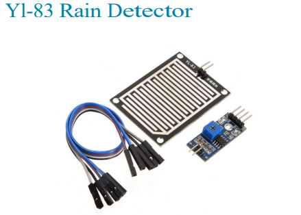

# Práctica con el Sensor de Lluvia YL-83 y ESP32

## Propósito de la práctica

En esta práctica, se utilizará un sensor de lluvia **YL-83** para detectar la presencia de agua (lluvia) mediante un **ESP32**. El objetivo es leer el estado del sensor (lluvia/no lluvia) y mostrar el resultado en el monitor serie.

## Estructura de archivos

El proyecto se organizará en tres archivos principales:
- **`sensor_yl83.h`**: Archivo de cabecera que define la clase `SensorYL83`.
- **`sensor_yl83.cpp`**: Archivo que implementa los métodos de la clase `SensorYL83`.
- **`main.cpp`**: Archivo principal que inicializa el sensor y gestiona el bucle principal del programa.

### Estructura del proyecto:
```markdown
├── include 
│ └── sensor_yl83.h # Archivo de cabecera para el sensor de lluvia YL-83 
├── src 
│ ├── main.cpp # Código principal donde se gestiona la lógica del programa
│ └── sensor_yl83.cpp # Implementación de la clase del sensor de lluvia YL-83 
└── platformio.ini # Archivo de configuración de PlatformIO
```

## Descripción de cada archivo y su función

### `sensor_yl83.h` (Archivo de cabecera)

Este archivo contiene la definición de la clase `SensorYL83`. Su propósito es declarar los atributos y métodos necesarios para interactuar con el sensor de lluvia.

```cpp
#ifndef SENSOR_YL83_H
#define SENSOR_YL83_H

#include <Arduino.h>

class SensorYL83 {
  private:
    int pin;  // Pin digital donde está conectado el sensor

  public:
    // Constructor que recibe el pin donde está conectado el sensor
    SensorYL83(int digitalPin);

    // Método de inicialización (aunque no requiere configuración especial)
    void begin();

    // Método para detectar lluvia (retorna true si está lloviendo)
    bool detectarLluvia();
};
```
#endif

## Explicación:

`#ifndef, #define y #endif:` Estas directivas evitan la inclusión múltiple del archivo (es decir, que se cargue el archivo más de una vez).  

`Clase SensorYL83:` Se define una clase que encapsula el comportamiento del sensor YL-83.  

### Atributos y métodos:
**int pin:** Almacena el pin GPIO donde está conectado el sensor.  

**SensorYL83(int digitalPin):** Constructor que inicializa el sensor con el pin asignado.  

**begin():** Configura el pin como entrada para que pueda recibir el estado del sensor.  

**detectarLluvia():** Lee el valor del pin digital y devuelve true si el sensor detecta lluvia.  


---

## `sensor_yl83.cpp` (Implementación de la clase)

Este archivo contiene el código que define cómo funcionan los métodos declarados en el archivo de cabecera.
```cpp
#include "sensor_yl83.h"

// Constructor que inicializa el pin del sensor
SensorYL83::SensorYL83(int digitalPin) {
  pin = digitalPin;
}

// Método begin: configura el pin como entrada
void SensorYL83::begin() {
  pinMode(pin, INPUT);
}

// Método para detectar si está lloviendo
bool SensorYL83::detectarLluvia() {
  // Leer el valor digital del sensor (HIGH = no lluvia, LOW = lluvia)
  return digitalRead(pin) == LOW;  // LOW indica que está lloviendo
}
```
## Explicación:
### Constructor 
`SensorYL83::SensorYL83(int digitalPin)`: Almacena el pin donde está conectado el sensor.  

`begin():` Configura el pin como entrada digital usando la función pinMode().  

`detectarLluvia():` Usa digitalRead() para leer el estado del pin digital. Si el pin está en LOW, significa que el sensor detecta lluvia, por lo tanto, devuelve true.

---
## `main.cpp` (Código principal)

Este archivo es el punto de entrada del programa. Inicializa el sensor y contiene el bucle principal que lee continuamente el estado del sensor y muestra los resultados en el monitor serie.
```cpp
#include <Arduino.h>
#include "sensor_yl83.h"   // Incluimos la cabecera del sensor de lluvia

// Instanciamos el sensor de lluvia en el pin GPIO 12
SensorYL83 rainSensor(12);

void setup() {
  Serial.begin(115200);  // Inicializamos la comunicación serie
  rainSensor.begin();    // Inicializamos el sensor de lluvia
}

void loop() {
  // Detectar si está lloviendo
  bool estaLloviendo = rainSensor.detectarLluvia();

  if (estaLloviendo) {
    Serial.println("Está lloviendo");
  } else {
    Serial.println("No está lloviendo");
  }

  delay(1000);  // Pausa de 1 segundo
}
```

## Explicación:
`SensorYL83 rainSensor(12):` Creamos una instancia de la clase SensorYL83 y especificamos el pin GPIO 12 como el pin donde está conectado el sensor.  

`Serial.begin(115200):` Inicializa la comunicación serie a 115200 baudios para poder mostrar los mensajes en el monitor serie.  

`rainSensor.begin():` Inicializa el sensor, configurando el pin como entrada digital.  

`loop():` Lee continuamente el estado del sensor cada segundo y muestra en el monitor serie si está lloviendo o no.  

### Conclusión
Esta práctica introduce a los sensores digitales en IoT, en este caso utilizando el sensor de lluvia YL-83. El código está organizado de manera modular para que sea fácil de entender, mantener y escalar. Si en el futuro se quiere agregar más sensores, simplemente se puede replicar la estructura de archivos.